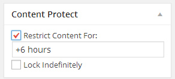
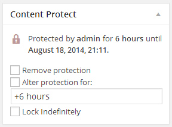
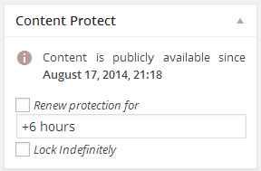
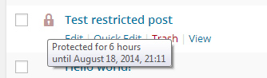
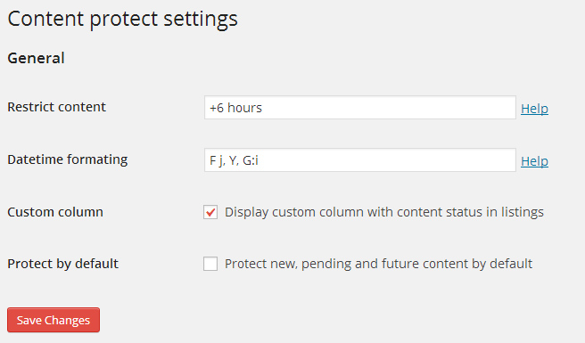

# Content Protect By Time Lock
##### Content display management regulated by time locks for Wordpress.

This WP plugin allows its owners to selectively set time locks on content they want to protect(hide) from anonymous users visiting the site for particular time period. The time period can be bright variety of types. For instance +1 min,  tomorrow or etc.

When content is protected it will be excluded from search results, author and post archives, menu navigation, feeds and more. If an anonymous user gets somehow a direct link to content and tries to access/view it, this user gets redirected to the login screen to enter credentials. After successfully log in the user gets redirected again but this time to the content itself.

## How it looks like?

## Applications
News sites, Blogs and/or any WP driven site which needs to present content according to viewer status.

## Installation
1. Upload plugin's .zip file to the "/wp-content/plugins/" directory.
2. Extract it there.
3. Activate the plugin through the "Plugins" menu in WordPress.

**Done!**

## Frequently Asked Questions
- How can I change the plugin settings?
  * The plugin is equipped with a options page under the "Settings"  menu in WP's admin area.
- Where can I find information about the supported date/time formats for the time locks?
  * All supported formats by the PHP's `strtotime()` function are supported by the plugin too. More [here]( http://php.net/manual/en/datetime.formats.relative.php).

## Contributing
Pull requests welcome! What you will need to do to contribute is:

- Fork, then clone this repo.
- Make your changes/updates.
- Push to your fork and submit a pull request.

Translators are welcome too!

## Support this work
As You know every work needs time. But time nowadays is not free... this plugin needs Your support.

[Gittip](https://gittip.com/ColorfullyMe)

## License
GPLv2 or later
